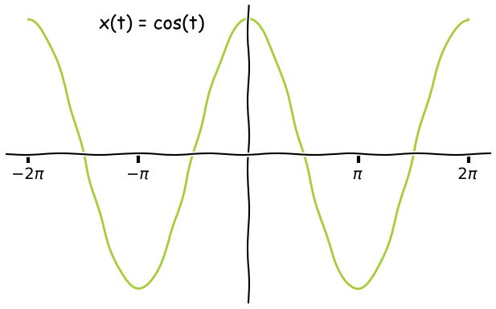
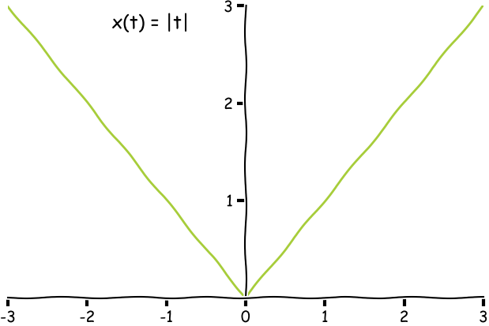

## Fourier transform

$$
x(t) = c_0 + \sum_{n=1}^\infty A_n \cos(n\omega_0t + \phi_n)
$$

Where $c_0$, $A_n$ and $\phi_n$ are based on the complex Fourier coefficients $c_n$.

~~~ matlab
y = fft(x)
% comment
~~~

Nog wat tekst  bal bla.

> This is a block quote ?
> Met een
> # Header ? huh
> * een
> * twee

En een regel.
<figure>
	
	
	<figcaption>
	Examples of even functions
	</figcaption>
</figure>
