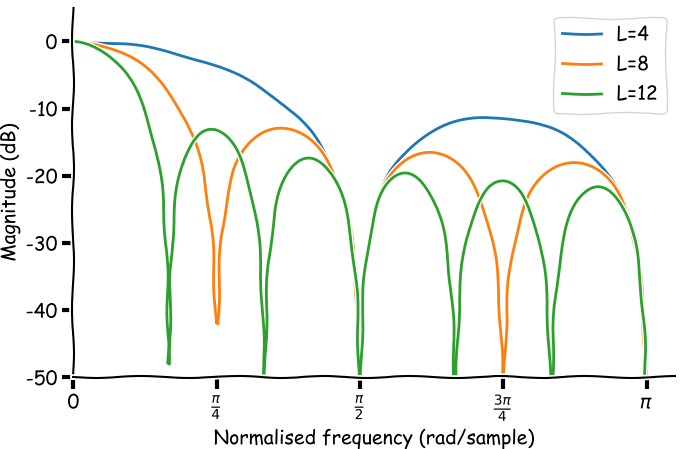
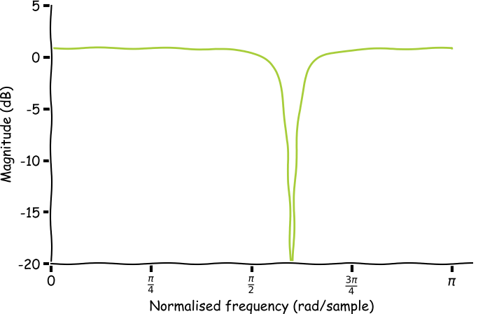

## Analog to Digital conversion

### Quantisation noise
<figure>
	
	<figcaption>
	Histogram of the quantisation noise.
	</figcaption>
</figure>

A simple model to describe the error introduced by the quantiser is an additive model.

$$
e[n] = x_q[n] - x[n]
$$

This error is often called quantisation noise.

The signal-to-quantisation-noise (SQNR) can be expressed in decibels as:

$$
SQNR = 10\log_{10}\frac{P_x}{P_n}
$$

Where $P_x$ is the signal power and $P_n$ is the power of the quantisation noise. The quantisation noise power can be derived from its probability density function.

$$
P_n = \sigma_e^2 = \int_{-\infty}^{\infty} e^2 p(e) de = \frac{1}{\Delta} \int_{-\frac{\Delta}{2}}^{\frac{\Delta}{2}} e^2 de = \frac{\Delta^2}{12}
$$

## Fourier transform

$$
x(t) = c_0 + \sum_{n=1}^\infty A_n \cos(n\omega_0t + \phi_n)
$$

Where $c_0$, $A_n$ and $\phi_n$ are based on the complex Fourier coefficients $c_n$.

## Symmetry
Symmetry of signals is a useful property for analysing signals and has an important role in the theory of power series and Fourier series. 

### Even symmetry
A signal is said to be even symmetric if it is identical to the reflection about the origin.

$$
x(t) = x(-t)
$$

<figure>
	
	
	
	<figcaption>
	Three examples of even functions.
	</figcaption>
</figure>

### Odd symmetry
A signal is said to be odd symmetric if:

$$
x(t) = -x(-t)
$$

<figure>
	
	
	
	<figcaption>
	Three examples of odd functions.
	</figcaption>
</figure>

### Decomposition
An arbitrary signal $x(t)$ can always be expressed as a sum of an even signal and an odd signal.

$$
x(t) = x_e(t) + x_o(t)
$$

Where the even part of the signal $x_e(t)$ is given by

$$
x_e(t) = \frac{1}{2} \left[ x(t) + x(-t) \right]
$$

and the odd part of the signal $x_o(t)$ is given by

$$
x_e(t) = \frac{1}{2} \left[ x(t) - x(-t) \right]
$$

## Useful digital filters

### Moving average filter
Moving average filters are used for smoothing a signal. 
The transfer function of a moving average filter of length $L$ is defined as:

$$
H(z) = \frac{1 + z^{-1} + z^{-2} + \ldots + z^{1-L}}{L}
$$

These filters can be implemented efficiently as only the contribution of the oldest sample has to be removed and the contribution of the newest sample should be added.
<figure>
	
	<figcaption>
	Frequency response of the moving average filter for three different lengths.
	</figcaption>
</figure>

~~~ python
import scipy.signal as signal

plt.figure()
L = 4
w, h = signal.freqz(np.ones((L, 1)), L)
plt.plot(w, 20*np.log10(np.abs(h)))
~~~

### Notch filter
Notch filters are very good at filtering out a single frequency. A common application of notch filters is to remove any interference at 50Hz caused by power lines.
The transfer function of the notch filter is:

$$
H(z) = \frac{1 -2\cos(\omega_n)z^{-1} + z^{-2}}{1 -2r\cos(\omega_n)z^{-1} + r^2z^{-2}}
$$

<figure>
	
	<figcaption>
	Frequency response of a notch filter ($\omega_n = 0.6\pi$)
	</figcaption>
</figure>

> This is a block quote ?
> Met een
> # Header ? huh
> * een
> * twee

En een regel.

